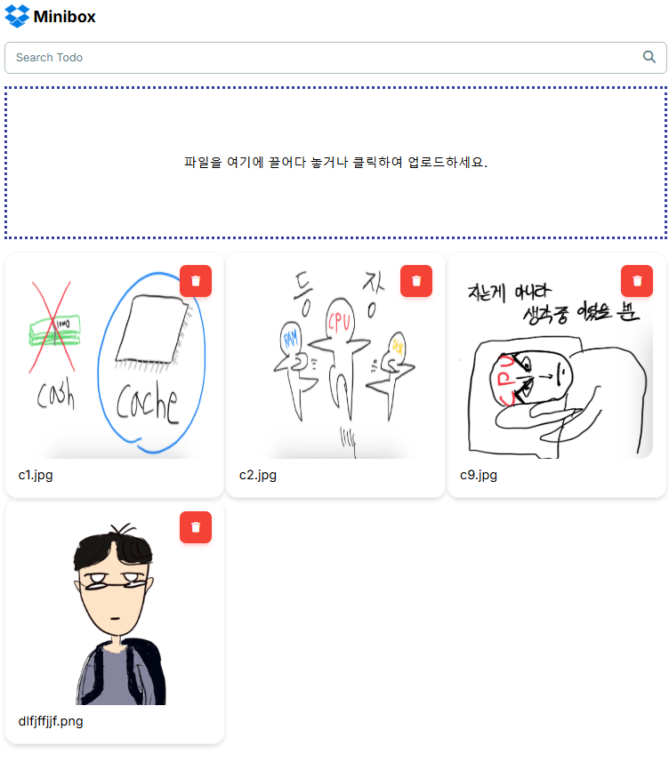

# Minibox


Next.js와 Supabase를 활용하여 Dropbox를 모티브로 한 미니멀한 이미지 저장소 프로젝트입니다.

## 🛠 기술 스택

### Frontend

- Next.js 14 (App Router)
- React
- TypeScript
- Tailwind CSS
- Material Tailwind

### Backend & Database

- Supabase (인증 및 스토리지)

### 상태 관리 & 비동기 처리

- TanStack Query (React Query)

## 📁 프로젝트 구조

```
├── actions/
│   └── storageActions.ts     # Supabase 스토리지 관련 액션
├── components/
│   ├── DropboxImage.tsx      # 개별 이미지 컴포넌트
│   ├── DropboxImageList.tsx  # 이미지 리스트 컴포넌트
│   ├── FileDragDropZone.tsx  # 파일 드래그&드롭 영역
│   ├── Logo.tsx             # 로고 컴포넌트
│   └── Searchbar.tsx        # 검색바 컴포넌트
├── config/
│   └── ReactQueryClientProvider.tsx  # React Query 설정
├── public/
│   └── images/              # 정적 이미지 파일
└── utils/
    └── supabase/           # Supabase 관련 유틸리티
```

## ✨ 주요 기능

### 1. 이미지 업로드

- 드래그 앤 드롭 방식의 이미지 업로드
- 다중 파일 업로드 지원
- 업로드 진행 상태 표시

### 2. 이미지 관리

- 이미지 목록 그리드 뷰
- 이미지 삭제 기능
- 이미지 검색 기능

### 3. 사용자 인터페이스

- 반응형 디자인 (모바일, 태블릿, 데스크톱)
- Material Tailwind 컴포넌트 활용
- 직관적인 UI/UX

## 🔍 사용된 라이브러리

```json
{
  "dependencies": {
    "@material-tailwind/react": "UI 컴포넌트",
    "@supabase/ssr": "Supabase SSR 클라이언트",
    "@tanstack/react-query": "서버 상태 관리",
    "next": "^14.x",
    "react": "^18.x",
    "react-dropzone": "파일 드래그&드롭",
    "typescript": "^5.x"
  }
}
```

## 개발 환경 설정

1. Supabase 프로젝트 생성
2. 스토리지 버킷 생성 및 공개 접근 설정
3. 환경 변수 파일 (.env.local) 설정
